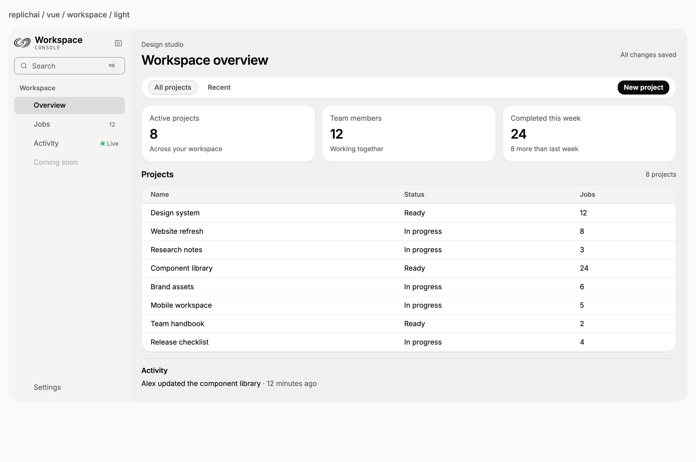
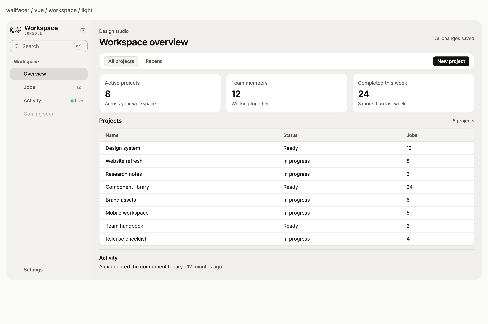
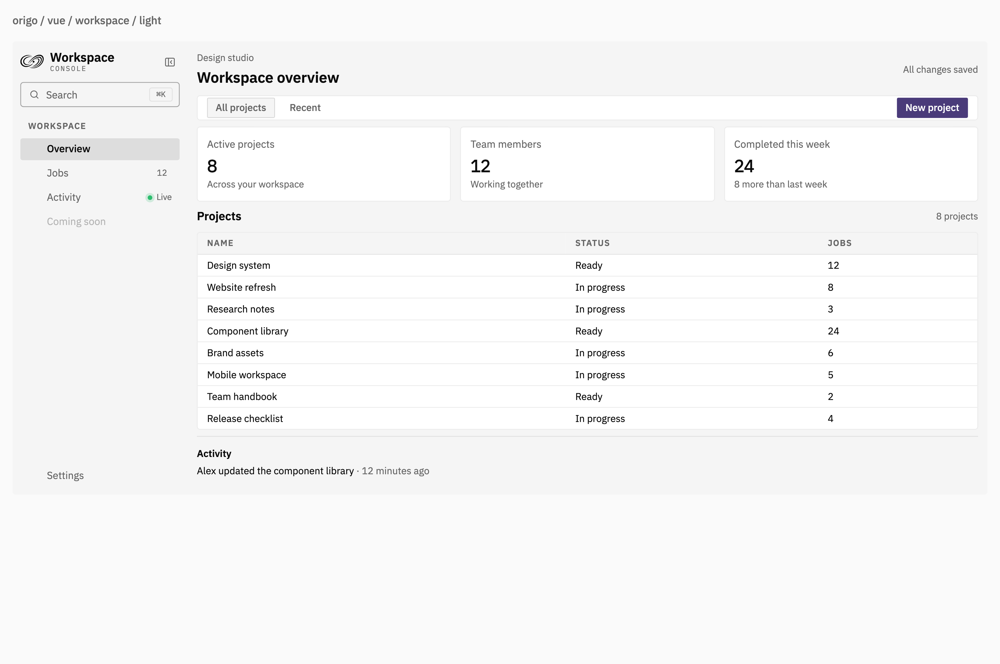

# A shared visual language

Use the same material, spacing, and interface patterns across product surfaces. This guide helps builders choose a surface, compose a screen, and inspect its reference figure. For props and code examples, use the [integration guide](api-guide.md).


## Fit the available space

Sibling panels, toolbars and tables share 14px corners. Toolbar buttons use 8px corners: the outer 14px radius minus the 6px vertical inset. Windows use 18px corners; fields and navigation rows use 8px. Panel padding is 16px; table cells use 8px vertical and 16px horizontal insets. Desktop controls are compact while coarse-pointer buttons and fields retain 44px targets. Use `--font-ui` to customize shell typography; the default is the platform system font. Generic controls inherit the host font, and product wordmarks retain their serif identity.


[Dark laptop](../tests/visual/goldens/darwin-27/workspace-dark-laptop.png) · [1470px laptop](../tests/visual/goldens/darwin-27/workspace-light-laptop-large.png) · [2560px desktop](../tests/visual/goldens/darwin-27/workspace-light-studio.png) · [Mobile](../tests/visual/goldens/darwin-27/vue-workspace-light-mobile.png)

Size layouts by the browser's available CSS pixels, rather than the monitor's physical resolution. A 224px console rail leaves more room for work on a laptop. The rail now shares the window edge: the shell owns outer corner clipping, and navigation has a flat selected fill without a detached card rim. This follows the [supplied macOS 27 Mail reference](https://www.apple.com/v/os/g/images/macos/improvements/search__gca3sckqsxym_large_2x.jpg). Keep reading lines bounded on wide displays. `DocsLayout` responds to its own container: below 1080px the table of contents disappears, and below 720px navigation moves above the article. Setting `showToc` to false also removes its grid column.

| Token | Default | Typical use |
|---|---|---|
| `--radius-xs` | 4px | Checkboxes and inline code |
| `--radius-sm` | 6px | Menu rows |
| `--radius-md` | 8px | Fields, navigation and compact footer controls |
| `--radius-lg` | 14px | Panels, toolbars, tables and menus |
| `--radius-xl` | 18px | Dialogs and outer windows |
| `--radius-2xl` | 24px | Large outer frames |
| `--radius-pill` | 999px | Standalone buttons, badges and switches |

The [Apple macOS reference](https://www.apple.com/os/macos/) informs the restrained chrome and readable material hierarchy. Our web implementation approximates the appearance through CSS blur, tint and light edges; it does not reproduce Apple's native Liquid Glass renderer.

## Keep product styling explicit

The gallery and integration examples use a neutral Workspace identity. A shell without `brandTheme` inherits its UI typography. Named product themes are opt-in; custom wordmarks and marks belong in the brand/logo slots. The product directory is a catalog, not the identity of the example application.

Choose an importable appearance for the existing components:

```ts
import 'latere-ui/tokens';
import 'latere-ui/glass';
import 'latere-ui/console'; // when using ConsoleSidebar
import 'latere-ui/presets';

document.documentElement.dataset.design = 'origo';
document.documentElement.dataset.theme = 'dark';
```

Use `replichai`, `wallfacer`, or `origo` on **the document root**. This gives teleported menus, dialogs and notifications the same appearance. Remove `data-design` to return to the default glass style. The stylesheet has no effect without a recognized value. Nested mixed presets are not supported. Set the attributes before mounting to avoid a flash of the default theme.

| Preset | Typography and density | Surfaces and actions | Reference source |
|---|---|---|---|
| `replichai` | Inter, 14px reading text, 32px fields | Warm matte surfaces, 18px cards, 8px fields; 30px ink actions with blue hover | [Replichai styles](https://github.com/latere-ai/replichai/blob/main/frontend/src/styles.css) |
| `wallfacer` | Inter, 13px operator UI, 32px fields | Warm matte surfaces, compact 14px cards, 10px fields; 30px ink actions with clay hover | [Wallfacer tokens](https://github.com/latere-ai/wallfacer/blob/main/frontend/src/styles/tokens.css) and [primitives](https://github.com/latere-ai/wallfacer/blob/main/frontend/src/styles/primitives.css) |
| `origo` | IBM Plex Sans/Mono, 13px UI, 28px table rows | Opaque surfaces without shadows, 4px panels/fields, 3px standalone buttons; iris primary actions | [Origo styles](https://github.com/latere-ai/origo-web/blob/main/internal/web/assets/app.css) |

These presets apply real geometry, typography, material and state changes to shared components. Replichai's actual card is 18px despite its 12px radius token; Wallfacer's preset chooses its compact 14px card rather than its generic 18px card. Toolbar actions keep concentric corners derived from their parent and inset. Circular status dots, avatars, radio indicators and switch thumbs retain their functional shapes.

All three map the glass tiers to opaque surfaces and inverse emphasis. Product presets disable backdrop blur and specular highlights; do not initialize the optional optical-effects runtime on them. Brand wordmarks remain separate from UI typography. The preset does not add branding or migrate a consuming application.

For readable small controls, muted text uses accessible secondary colors, controls retain clear boundaries, and clay hover actions use dark ink. These are deliberate accessibility adaptations of the source styles. Coarse-pointer controls retain at least 44px targets. Both themes have dedicated figures and interaction checks.

Supply Inter for Replichai/Wallfacer and IBM Plex Sans/Mono for Origo through your own font pipeline; the preset falls back to system faces if absent. The test gallery bundles local licensed faces, waits for them before mounting, and makes no font network requests. Override `--font-ui` and `--font-mono` after the preset if your application needs another family.

| Replichai | Wallfacer | Origo |
|---|---|---|
| [](../tests/visual/goldens/darwin-27/replichai-vue-workspace-light-desktop.png) | [](../tests/visual/goldens/darwin-27/wallfacer-vue-workspace-light-desktop.png) | [](../tests/visual/goldens/darwin-27/origo-vue-workspace-light-desktop.png) |
| [Dark](../tests/visual/goldens/darwin-27/replichai-vue-workspace-dark-desktop.png) · [Forms](../tests/visual/goldens/darwin-27/replichai-vue-forms-light-desktop.png) | [Dark](../tests/visual/goldens/darwin-27/wallfacer-vue-workspace-dark-desktop.png) · [Forms](../tests/visual/goldens/darwin-27/wallfacer-vue-forms-light-desktop.png) | [Dark](../tests/visual/goldens/darwin-27/origo-vue-workspace-dark-desktop.png) · [Forms](../tests/visual/goldens/darwin-27/origo-vue-forms-light-desktop.png) |

Open the figures at full size or use the [complete per-style component index](visual-reference.md#product-style-variations). Run `bun run visual:dev` to explore their live gallery links.

## Start with the material

Glass combines a translucent fill, backdrop blur, a highlighted edge, and a shadow. Its depth helps distinguish a control from a panel or an overlay. The default appearance uses ink controls; optional product presets replace the material and interaction palette as described above.

| Tier | CSS class | Choose it for |
|---|---|---|
| Ultrathin | `.lu-glass-ultrathin` | Fields, badges, lightweight controls |
| Thin | `.lu-glass-thin` | Button surfaces and segmented tracks |
| Regular | `.lu-glass` | Panels, toolbars, and navigation |
| Thick | `.lu-glass-thick` | Dialogs, dropdowns, and other reading overlays |
| Smoke | `.lu-glass-smoke` | Inverse emphasis with theme-aware foreground |


The component and material both matter. `GlassPanel` adds content spacing, `GlassBar` arranges controls horizontally, and `GlassSurface` provides the basic material box. The tier selects their optical treatment. Render a gradient or other stable canvas behind glass; setting a custom property alone does not paint the page.

## Make the states visible

A control's shape should survive its different states. Review the resting control alongside its small, disabled, loading, and focused versions. For forms, also inspect empty values, errors, checked choices, and open option lists.


Use `GlassBadge` for compact status, `GlassAlert` for a message that needs room, and `GlassProgress` or `GlassSpinner` for work in progress. Keep the status label meaningful without relying on its color.

## Compose a screen

Put navigation and account controls in the sidebar, content in the main area, and interrupting decisions in an overlay. A compact footer fits application screens; the full footer presents the product family and site links.


The sidebar supports a collapsed rail and custom brand, row, and footer content. Keep route selection in the host application. Use a modal for a focused decision, a drawer for a side task, and a popover for a local choice.


`DocsLayout` gives long-form material a reading order: grouped index, article, then table of contents. The mobile layout puts navigation above the article. Keep the article readable independently of the surrounding glass chrome.


Compact footer links wrap as complete labels, with theme and language controls below them. No horizontal scrolling is required to discover the links. Desktop preference controls share a 28px height; touch devices receive larger targets.

Footer language and theme choices belong to the host's preferences. Supply the language options your application supports; English, Chinese, and German footer copy ships in the package. Resolve an automatic theme to a concrete light or dark theme before applying it to the document.

## Add optical effects deliberately

The CSS material works without JavaScript. The optional Liquid Glass runtime adds edge refraction where the browser supports it and a cursor-following sheen on opted-in surfaces. Use sheen on a deliberate feature panel, where pointer movement helps explain the surface.


Test effects over a recognizable backdrop so refraction is visible. Check both themes, a resized surface, and preference changes. Reduced motion suppresses sheen; reduced transparency suppresses refraction. The material also has contrast and backdrop-filter fallbacks. Verify actual foreground contrast when you customize the palette or background.

## Keep the figures reviewable

Golden figures are committed PNGs from the browser fixtures, using fixed content, platform UI fonts with bundled brand/code fonts, and named viewport/theme combinations. They render at 3.125× the CSS layout size and carry 300 DPI metadata for clear enlarged and printed views. The design skeleton is SVG and scales without pixelation. Their filenames identify the framework, scenario, theme, and viewport. For example, `react-buttons-dark-desktop.png` shows the React button fixture in dark mode at the desktop size.

The [reference index](visual-reference.md) maps components to their figures. The [review findings](visual-review.md) record corrected defects and coverage limits. Follow [Contributing](../CONTRIBUTING.md) to compare them, inspect a difference, and update a baseline only after reviewing the intended change.

The [compact template review](compact-design-review.md) records the latest spacing, control and responsive-layout corrections.

Shared styles keep Vue and React aligned; each adapter has its own baseline. A screenshot verifies appearance at one point in a scenario. Interaction tests verify what happens when a reader types, selects, opens, dismisses, or navigates.
