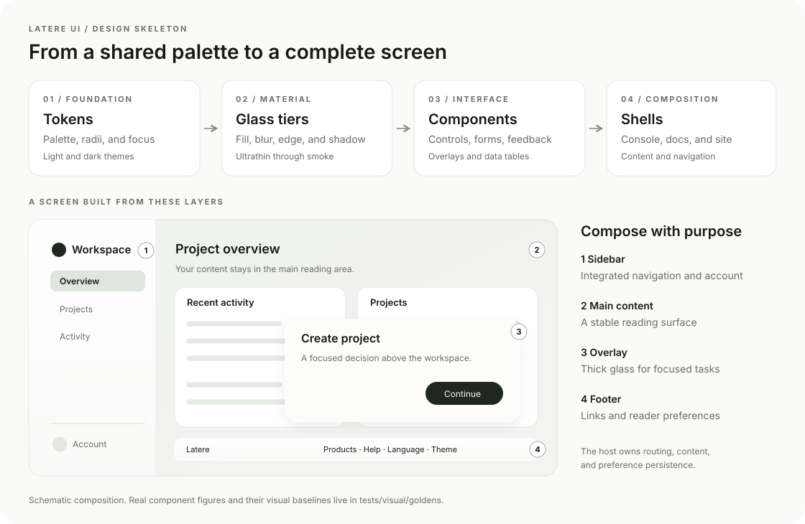
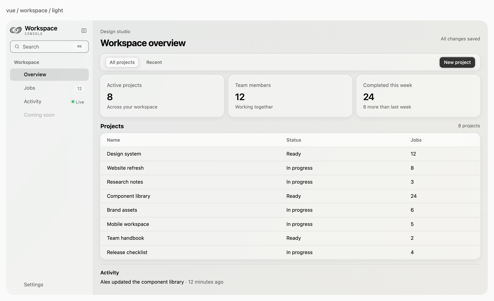
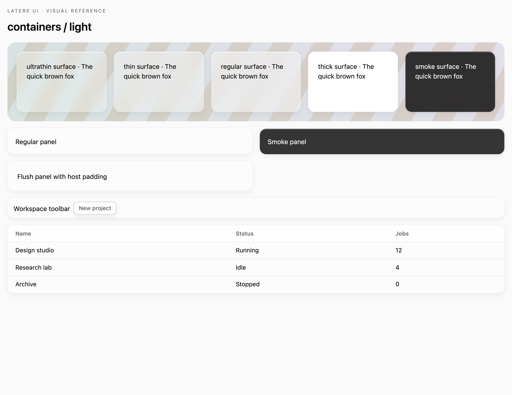
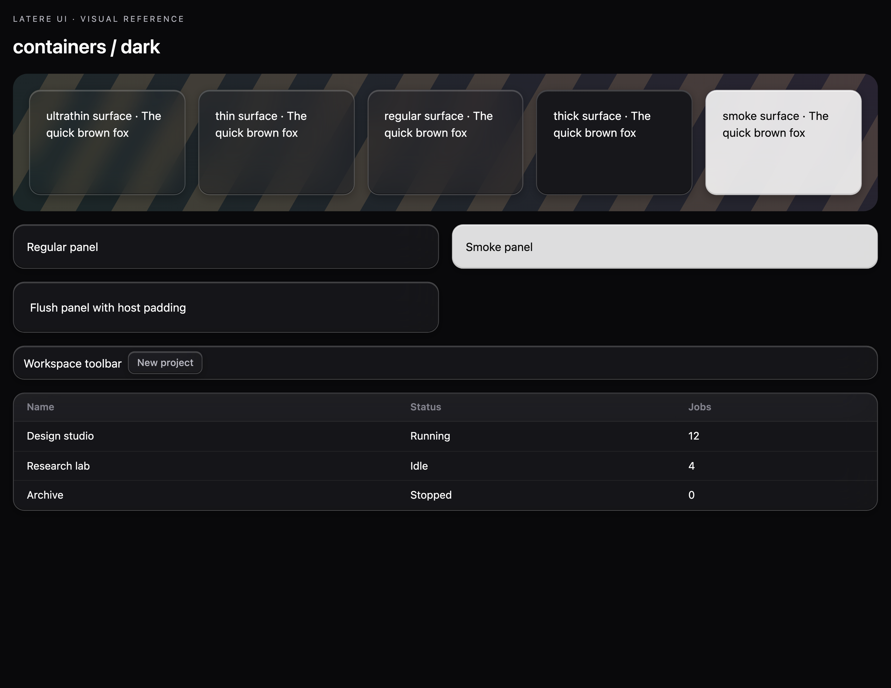
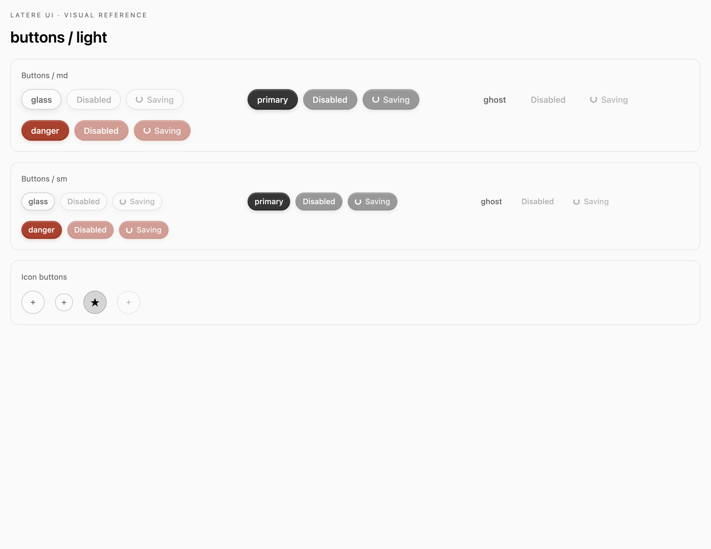
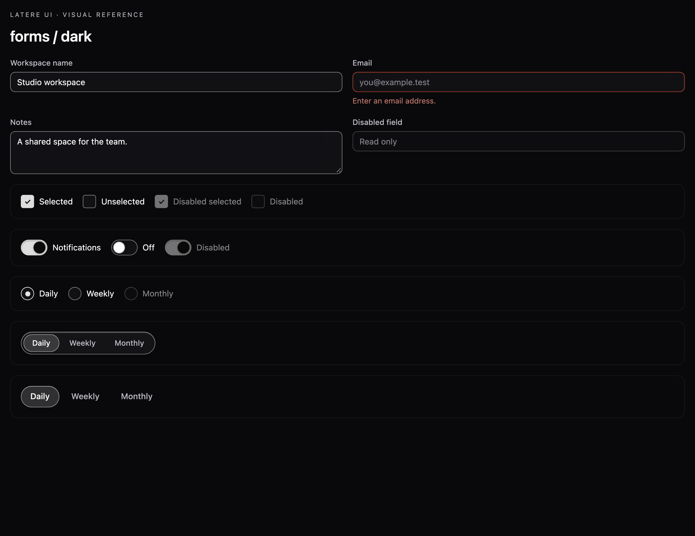
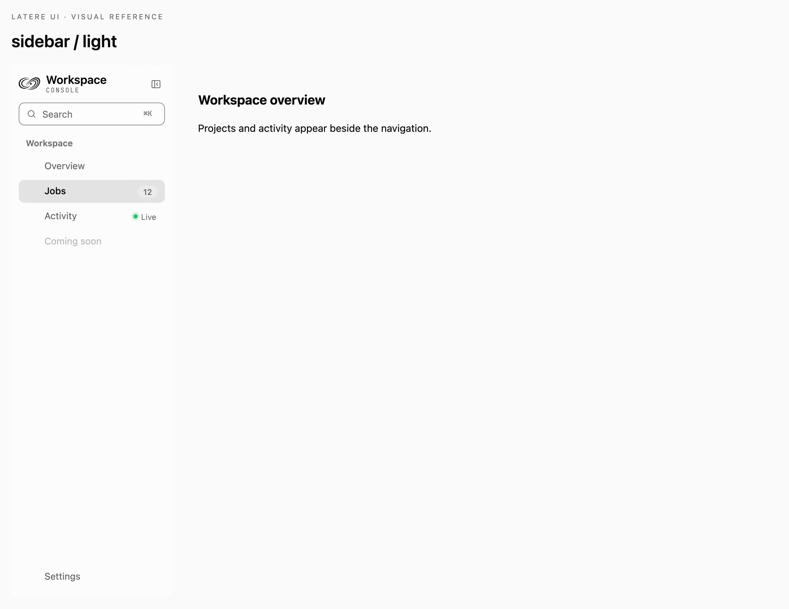
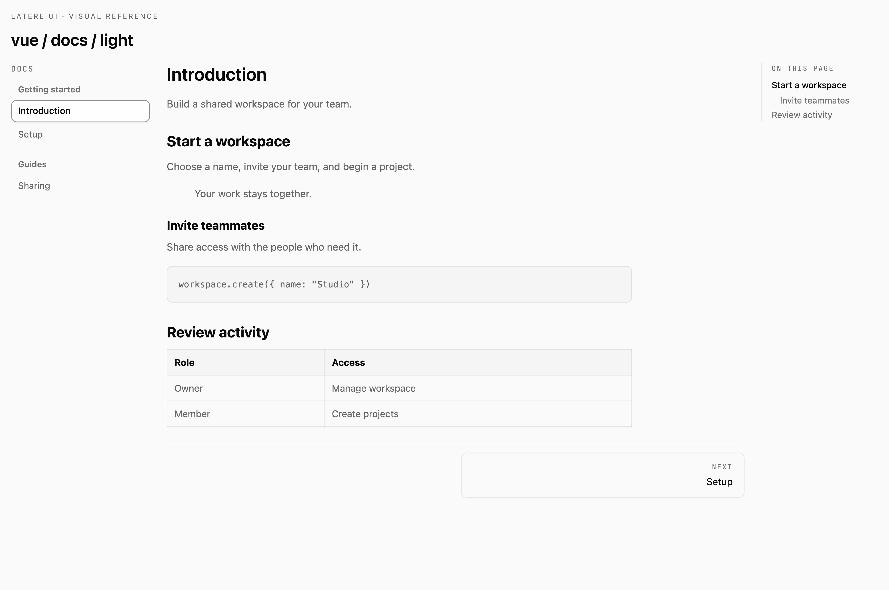
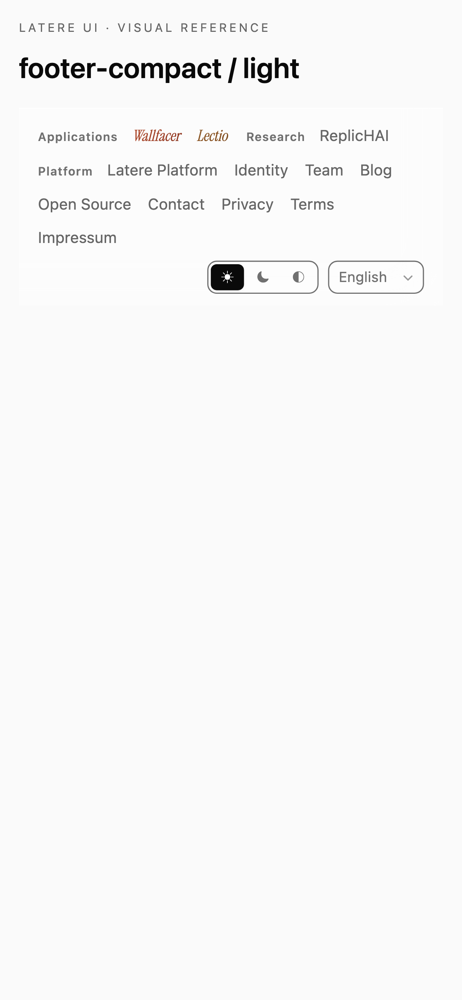
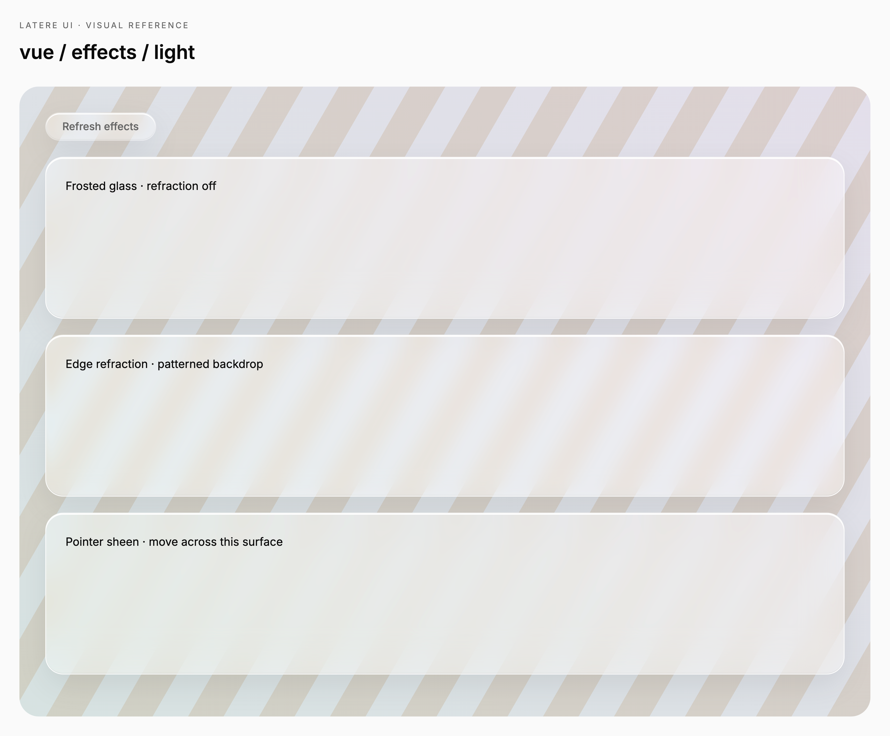

# A shared visual language

Use the same material, spacing, and interface patterns across product surfaces. This guide helps builders choose a surface, compose a screen, and inspect its reference figure. For props and code examples, use the [integration guide](api-guide.md).

## Fit the available space

The default template uses 14px panel corners, 18px window corners, and 8px fields and navigation rows. Panel padding is 16px; table cells use 8px vertical and 12px horizontal insets. Desktop controls are compact while coarse-pointer buttons and fields retain 44px targets. Use `--font-ui` to customize shell typography; the default is the platform system font. Generic controls inherit the host font, and product wordmarks retain their serif identity.

[Dark laptop](../tests/visual/goldens/darwin-27/workspace-dark-laptop.png) · [1470px laptop](../tests/visual/goldens/darwin-27/workspace-light-laptop-large.png) · [2560px desktop](../tests/visual/goldens/darwin-27/workspace-light-studio.png) · [Mobile](../tests/visual/goldens/darwin-27/vue-workspace-light-mobile.png)

Size layouts by the browser's available CSS pixels, rather than the monitor's physical resolution. A 224px console rail leaves more room for work on a laptop. Keep reading lines bounded on wide displays. `DocsLayout` responds to its own container: below 1080px the table of contents disappears, and below 720px navigation moves above the article. Setting `showToc` to false also removes its grid column.

| Token | Default | Typical use |
|---|---|---|
| `--radius-xs` | 4px | Checkboxes and inline code |
| `--radius-sm` | 6px | Menu rows |
| `--radius-md` | 8px | Fields, navigation and tables |
| `--radius-lg` | 14px | Panels and menus |
| `--radius-xl` | 18px | Dialogs and sidebar |
| `--radius-2xl` | 24px | Large outer frames |
| `--radius-pill` | 999px | Buttons, badges and switches |

The [Apple macOS reference](https://www.apple.com/os/macos/) informs the restrained chrome and readable material hierarchy. Our web implementation approximates the appearance through CSS blur, tint and light edges; it does not reproduce Apple's native Liquid Glass renderer.

## Start with the material

Glass combines a translucent fill, backdrop blur, a highlighted edge, and a shadow. Its depth helps distinguish a control from a panel or an overlay. Product identity appears in wordmarks; controls use the shared ink palette.

| Tier | CSS class | Choose it for |
|---|---|---|
| Ultrathin | `.lu-glass-ultrathin` | Fields, badges, lightweight controls |
| Thin | `.lu-glass-thin` | Button surfaces and segmented tracks |
| Regular | `.lu-glass` | Panels, toolbars, and navigation |
| Thick | `.lu-glass-thick` | Dialogs, dropdowns, and other reading overlays |
| Smoke | `.lu-glass-smoke` | Inverse emphasis with theme-aware foreground |

The component and material both matter. `GlassPanel` adds content spacing, `GlassBar` arranges controls horizontally, and `GlassSurface` provides the basic material box. The tier selects their optical treatment. Render a gradient or other stable canvas behind glass; setting a custom property alone does not paint the page.

## Make the states visible

A control's shape should survive its different states. Review the resting control alongside its small, disabled, loading, and focused versions. For forms, also inspect empty values, errors, checked choices, and open option lists.

Use `GlassBadge` for compact status, `GlassAlert` for a message that needs room, and `GlassProgress` or `GlassSpinner` for work in progress. Keep the status label meaningful without relying on its color.

## Compose a screen

Put navigation and account controls in the sidebar, content in the main area, and interrupting decisions in an overlay. A compact footer fits application screens; the full footer presents the product family and site links.

The sidebar supports a collapsed rail and custom brand, row, and footer content. Keep route selection in the host application. Use a modal for a focused decision, a drawer for a side task, and a popover for a local choice.

`DocsLayout` gives long-form material a reading order: grouped index, article, then table of contents. The mobile layout puts navigation above the article. Keep the article readable independently of the surrounding glass chrome.

On narrow screens, the compact footer gives navigation a full-width scrolling row, with theme and language controls below it.

Footer language and theme choices belong to the host's preferences. Supply the language options your application supports; English, Chinese, and German footer copy ships in the package. Resolve an automatic theme to a concrete light or dark theme before applying it to the document.

## Add optical effects deliberately

The CSS material works without JavaScript. The optional Liquid Glass runtime adds edge refraction where the browser supports it and a cursor-following sheen on opted-in surfaces. Use sheen on a deliberate feature panel, where pointer movement helps explain the surface.

Test effects over a recognizable backdrop so refraction is visible. Check both themes, a resized surface, and preference changes. Reduced motion suppresses sheen; reduced transparency suppresses refraction. The material also has contrast and backdrop-filter fallbacks. Verify actual foreground contrast when you customize the palette or background.

## Keep the figures reviewable

Golden figures are committed PNGs from the browser fixtures, using fixed content, platform UI fonts with bundled brand/code fonts, and named viewport/theme combinations. They render at 3.125× the CSS layout size and carry 300 DPI metadata for clear enlarged and printed views. The design skeleton is SVG and scales without pixelation. Their filenames identify the framework, scenario, theme, and viewport. For example, `react-buttons-dark-desktop.png` shows the React button fixture in dark mode at the desktop size.

The [reference index](visual-reference.md) maps components to their figures. The [review findings](visual-review.md) record corrected defects and coverage limits. Follow [Contributing](../CONTRIBUTING.md) to compare them, inspect a difference, and update a baseline only after reviewing the intended change.

Shared styles keep Vue and React aligned; each adapter has its own baseline. A screenshot verifies appearance at one point in a scenario. Interaction tests verify what happens when a reader types, selects, opens, dismisses, or navigates.
