# A shared visual language

Use the same material, spacing, and interface patterns across product surfaces. This guide helps builders choose a surface, compose a screen, and inspect its reference figure. For props and code examples, use the [integration guide](api-guide.md) or [React shell guide](react-shell.md). The guide describes `main`; the few changes not yet in a release are listed under Unreleased in the [changelog](../CHANGELOG.md#unreleased).

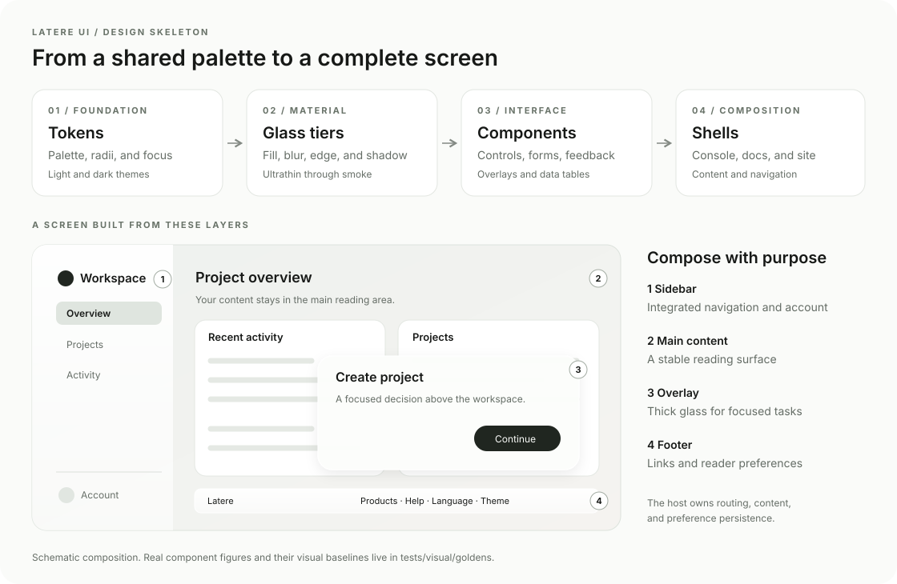

## Fit the available space

Sibling panels, toolbars and tables share 14px corners. Buttons are capsules everywhere, toolbars included: a capsule has no corner to nest, so the concentric rule, an inner corner equal to the outer one minus the inset, governs boxes inside a toolbar, not its buttons. Windows use 18px corners; fields and navigation rows use 8px. Panel padding is 16px; table cells use 8px vertical and 16px horizontal insets. Desktop controls are compact while coarse-pointer buttons and fields retain 44px targets. Use `--font-ui` to customize shell typography; the default is the platform system font. Generic controls inherit the host font, and product wordmarks retain their serif identity.

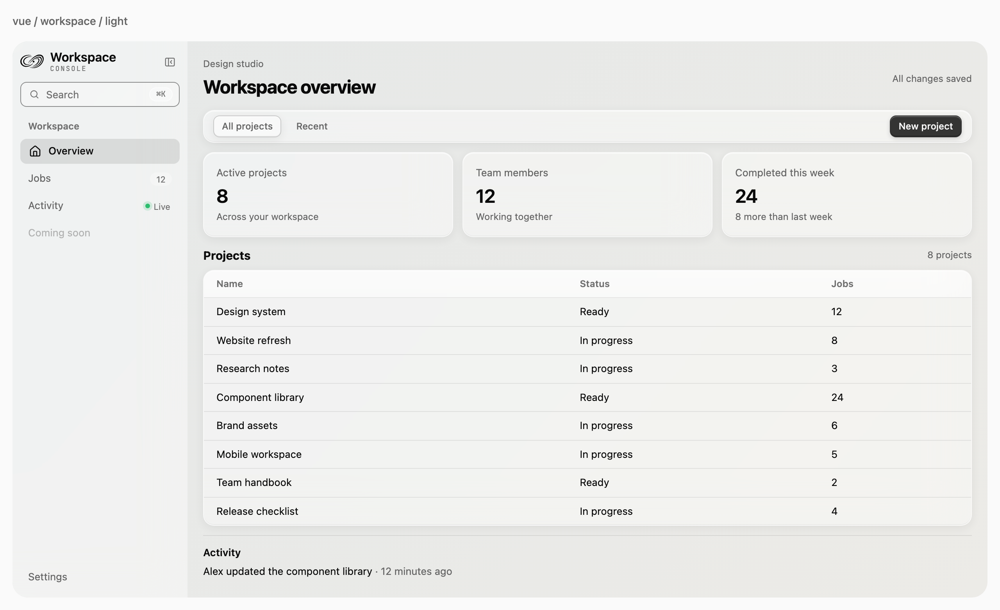

[Dark laptop](../tests/visual/goldens/darwin-24/workspace-dark-laptop.png) · [1470px laptop](../tests/visual/goldens/darwin-24/workspace-light-laptop-large.png) · [2560px desktop](../tests/visual/goldens/darwin-24/workspace-light-studio.png) · [Mobile](../tests/visual/goldens/darwin-24/workspace-light-mobile.png)

Size layouts by the browser's available CSS pixels, rather than the monitor's physical resolution. A 224px console rail leaves more room for work on a laptop. The rail shares the window edge: the shell owns outer corner clipping, and navigation has a flat selected fill without a detached card rim, following the [macOS 27 Mail window](https://www.apple.com/v/os/g/images/macos/improvements/search__gca3sckqsxym_large_2x.jpg). Keep reading lines bounded on wide displays. `DocsLayout` responds to its own container: below 1080px the table of contents disappears, and below 720px navigation moves above the article. Setting `showToc` to false also removes its grid column.

| Token | Default | Typical use |
|---|---|---|
| `--radius-xs` | 4px | Checkboxes and inline code |
| `--radius-sm` | 6px | Menu rows when no control corner is set |
| `--radius-md` | 8px | Fields and navigation |
| `--radius-lg` | 14px | Panels, toolbars, tables and menus |
| `--radius-xl` | 18px | Dialogs and outer windows |
| `--radius-2xl` | 24px | Large outer frames |
| `--radius-pill` | 999px | Buttons when no button corner is set, badges and switches |

Two tokens set the corners of controls apart from the ladder. `--lu-button-radius` (default `--radius-pill`) rounds every button, icon button and the theme and language buttons. `--lu-control-radius` rounds fields, selects, menu rows, and menu and popover panels, which add their padding to it; without it each keeps its ladder step. Keep a capsule out of `--lu-control-radius`: it would turn every menu panel into a pill.

The [Apple macOS reference](https://www.apple.com/os/macos/) informs the restrained chrome and readable material hierarchy. Our web implementation approximates the appearance through CSS blur, tint and light edges; it does not reproduce Apple's native Liquid Glass renderer.

## Keep product styling explicit

The gallery and integration examples use a neutral Workspace identity. A shell without `brandTheme` inherits its UI typography. Named product themes are opt-in; custom wordmarks and marks belong in the brand/logo slots. The product directory is a catalog, not the identity of the example application.

Choose an importable appearance for the existing components:

```ts
import 'latere-ui/tokens';
import 'latere-ui/glass';
import 'latere-ui/console'; // when using ConsoleSidebar
import 'latere-ui/docs'; // when using DocsLayout
import 'latere-ui/presets'; // after all shared/layout styles

document.documentElement.dataset.design = 'origo';
document.documentElement.dataset.theme = 'dark';
```

Use `replichai`, `wallfacer`, or `origo` on **the document root**. This gives teleported menus, dialogs and notifications the same appearance. Remove `data-design` to return to the default glass style. The stylesheet has no effect without a recognized value. Nested mixed presets are not supported. Set the attributes before mounting to avoid a flash of the default theme.

| Preset | Typography and density | Surfaces and actions | Reference source |
|---|---|---|---|
| `replichai` | Inter, 14px reading text, 32px fields | Warm matte surfaces, 18px cards, 8px fields; 30px ink actions with blue hover | Replichai's reading interface |
| `wallfacer` | Inter, 13px operator UI, 32px fields | Warm matte surfaces, compact 14px cards, 10px fields; 30px ink actions with clay hover | [Wallfacer tokens](https://github.com/latere-ai/wallfacer/blob/main/frontend/src/styles/tokens.css) and [primitives](https://github.com/latere-ai/wallfacer/blob/main/frontend/src/styles/primitives.css) |
| `origo` | IBM Plex Sans/Mono, 13px UI, 28px table rows | Opaque surfaces without shadows, 4px panels/fields, 3px standalone buttons; iris primary actions | [Origo styles](https://github.com/latere-ai/origo-web/blob/main/internal/web/assets/app.css) |

These presets apply real geometry, typography, material and state changes to shared components. Replichai's actual card is 18px despite its 12px radius token; Wallfacer's preset chooses its compact 14px card rather than its generic 18px card. Toolbar actions keep concentric corners derived from their parent and inset. Circular status dots, avatars, radio indicators and switch thumbs retain their functional shapes.

Origo's selected segments use visible 3px corners. Their tracks include the border and padding inset: 7px outer corners in form segmented controls.

All three map the glass tiers to opaque surfaces and inverse emphasis. Product presets disable backdrop blur and specular highlights; do not initialize the optional optical-effects runtime on them. Brand wordmarks remain separate from UI typography. The preset does not add branding or migrate a consuming application.

For readable small controls, muted text uses accessible secondary colors, controls retain clear boundaries, and clay hover actions use dark ink. These are deliberate accessibility adaptations of the source styles. Coarse-pointer controls retain at least 44px targets. Both themes have dedicated figures and interaction checks.

Supply Inter for Replichai/Wallfacer and IBM Plex Sans/Mono for Origo through your own font pipeline; the preset falls back to system faces if absent. Stylesheets select font families but do not download them. Product wordmarks use Instrument Serif with serif fallbacks; load that face separately when you use those marks. The test gallery bundles local licensed faces, waits for them before mounting, and makes no font network requests. Override `--font-ui` and `--font-mono` after the preset if your application needs another family.

| Replichai | Wallfacer | Origo |
|---|---|---|
| [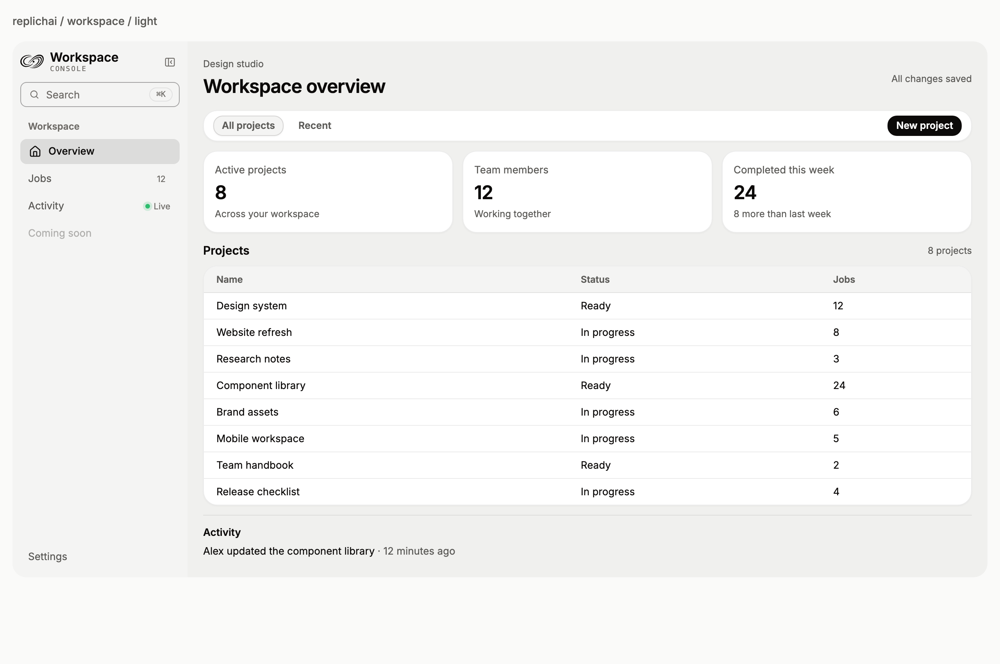](../tests/visual/goldens/darwin-24/replichai-workspace-light-desktop.png) | [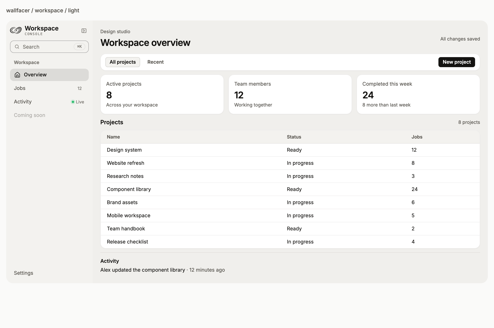](../tests/visual/goldens/darwin-24/wallfacer-workspace-light-desktop.png) | [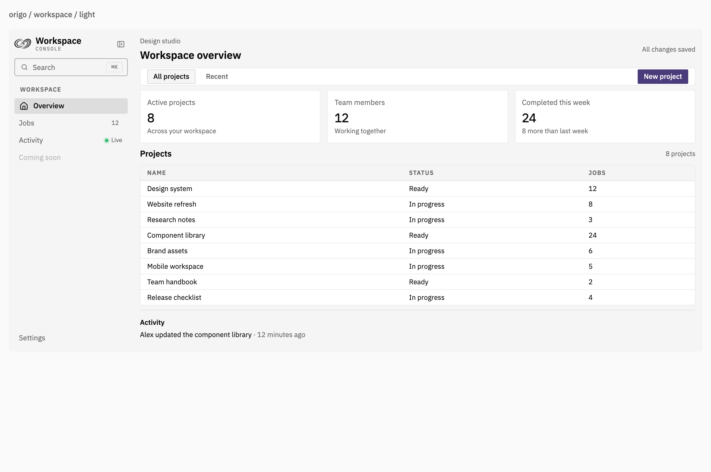](../tests/visual/goldens/darwin-24/origo-workspace-light-desktop.png) |
| [Dark](../tests/visual/goldens/darwin-24/replichai-workspace-dark-desktop.png) · [Forms](../tests/visual/goldens/darwin-24/replichai-forms-light-desktop.png) | [Dark](../tests/visual/goldens/darwin-24/wallfacer-workspace-dark-desktop.png) · [Forms](../tests/visual/goldens/darwin-24/wallfacer-forms-light-desktop.png) | [Dark](../tests/visual/goldens/darwin-24/origo-workspace-dark-desktop.png) · [Forms](../tests/visual/goldens/darwin-24/origo-forms-light-desktop.png) |

The appearance matrix renders every component in Vue and React, in desktop/light, desktop/dark, mobile/light and mobile/dark. Open the figures at full size or use the [complete per-style component index](visual-reference.md#product-style-variations). Run `bun run visual:dev` to explore their live gallery links.

## Start with the material

Glass combines a translucent fill, backdrop blur, a highlighted edge, and a shadow. Its depth separates a panel, a toolbar or an overlay from the content under it. Controls carry no material: a button is a flat capsule that reads by its tone and its 1px edge. Optional product presets replace the material and interaction palette as described above.

| Tier | CSS class | Choose it for |
|---|---|---|
| Ultrathin | `.lu-glass-ultrathin` | Fields, badges, lightweight controls |
| Thin | `.lu-glass-thin` | Segmented tracks and the selected tab |
| Regular | `.lu-glass` | Panels, toolbars, and navigation |
| Thick | `.lu-glass-thick` | Dialogs, dropdowns, and other reading overlays |
| Smoke | `.lu-glass-smoke` | Inverse emphasis with theme-aware foreground |

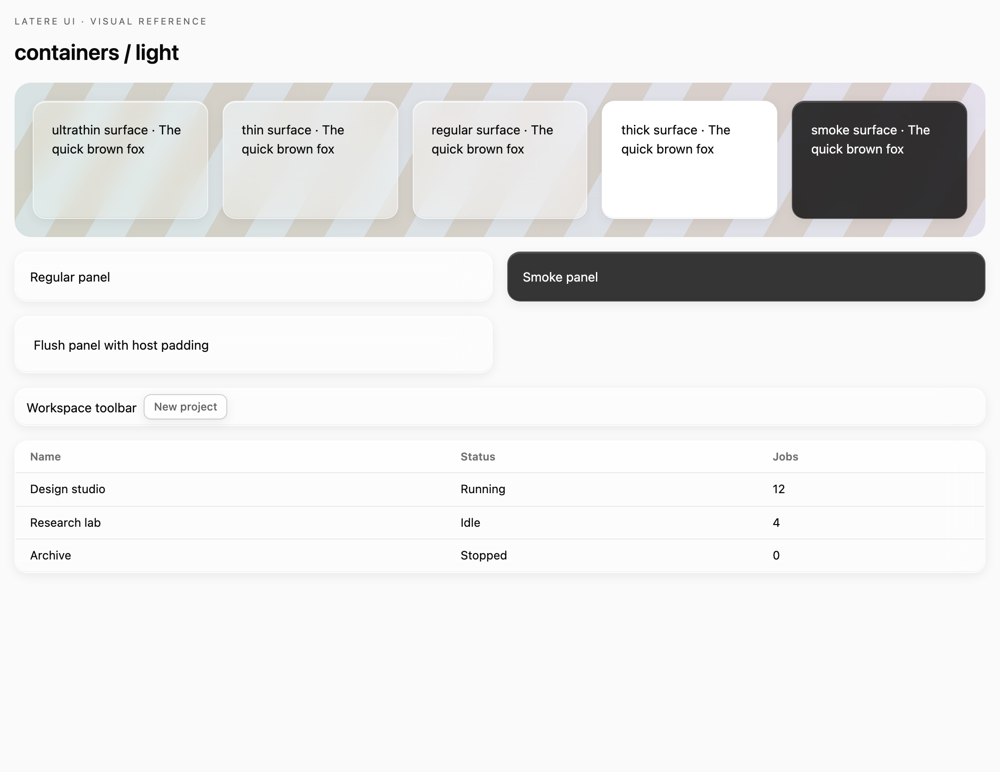

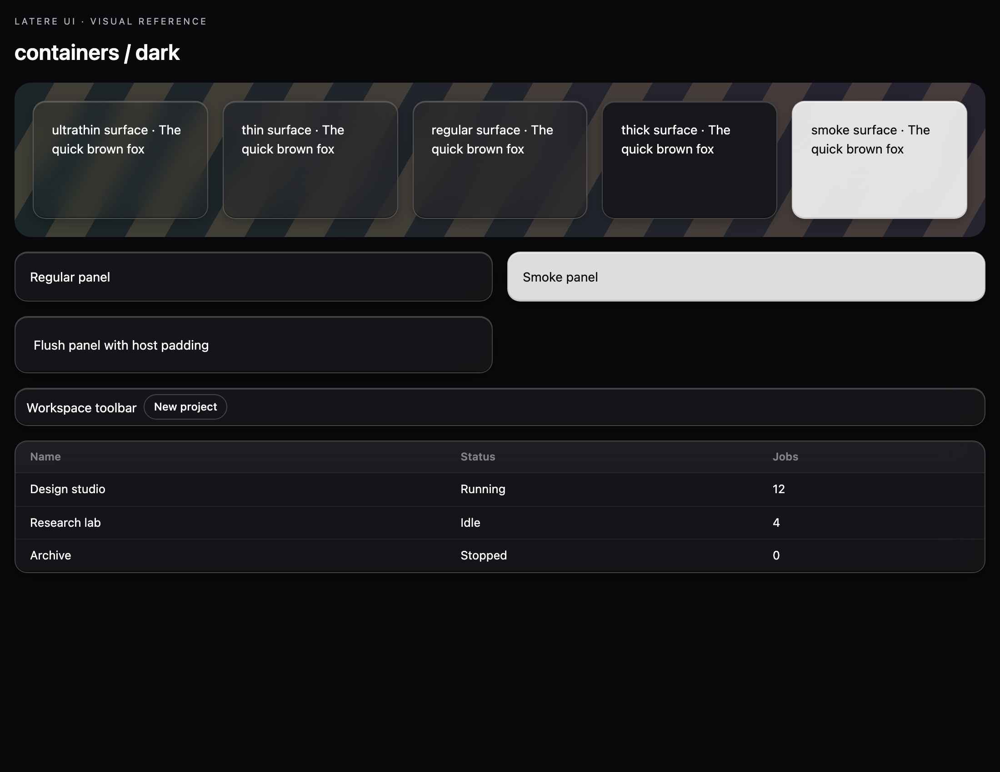

The component and material both matter. `GlassPanel` adds content spacing, `GlassBar` arranges controls horizontally, and `GlassSurface` provides the basic material box. The tier selects their optical treatment. Render a gradient or other stable canvas behind glass; setting a custom property alone does not paint the page.

## Make the states visible

A control's shape should survive its different states. Review the resting control alongside its small, disabled, loading, and focused versions. For forms, also inspect empty values, errors, checked choices, and open option lists.

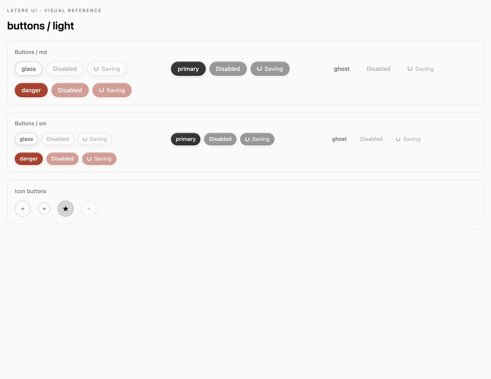

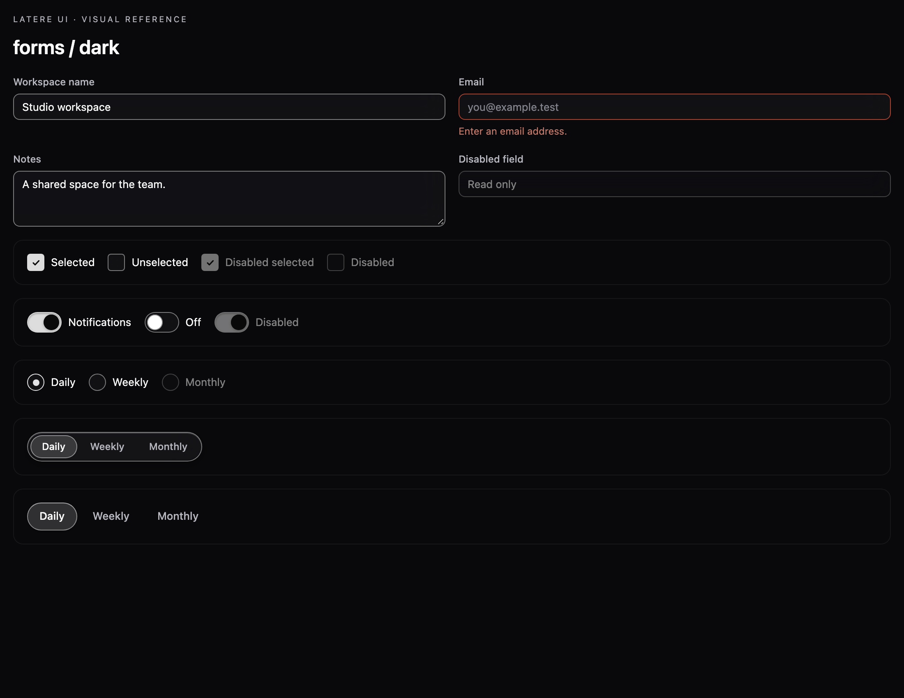

Use `GlassBadge` for compact status, `GlassAlert` for a message that needs room, and `GlassProgress` or `GlassSpinner` for work in progress. Keep the status label meaningful without relying on its color. An alert leads with an icon in its tone and keeps an even hairline frame; weight on one edge of a box reads as decoration, not as meaning.

Size controls from one scale. Buttons, fields and selects share a height (32px, and 28px for small controls), so a field and the button that submits it sit on one baseline. Every button is a capsule in one of three flat treatments: a dark ink fill for the one primary action on a screen, a 1px hairline outline for the other actions, and a bare label for quiet ones. No button carries glass, blur or a shadow; menus, popovers and dialogs keep their elevation. A destructive action among others is set as text, or lives in a row's menu; only the confirming button of a dialog fills with the danger color.

## Tell links from actions

An action is a button, never an underlined word. A link inside prose keeps a constant underline, a hairline set clear of the descenders in a softened tone of the link color, because the line tells the reader the words lead somewhere. A navigational link in the interface, such as a breadcrumb, a row name or a sidebar entry, carries no underline; its place and its color say it leads somewhere. No link gains or loses its underline with the pointer.

## Mark what only admins see

A row, a panel or a page only people with an admin role are shown carries one marker: the audience color on its icon and a small chip that names the audience. Use the same marker everywhere it holds, in the navigation and inside screens everyone sees, so an admin can tell at a glance what other people will not find.

## Compose a screen

Put navigation and account controls in the sidebar, content in the main area, and interrupting decisions in an overlay. A compact footer fits application screens; the full footer presents the product family and site links.

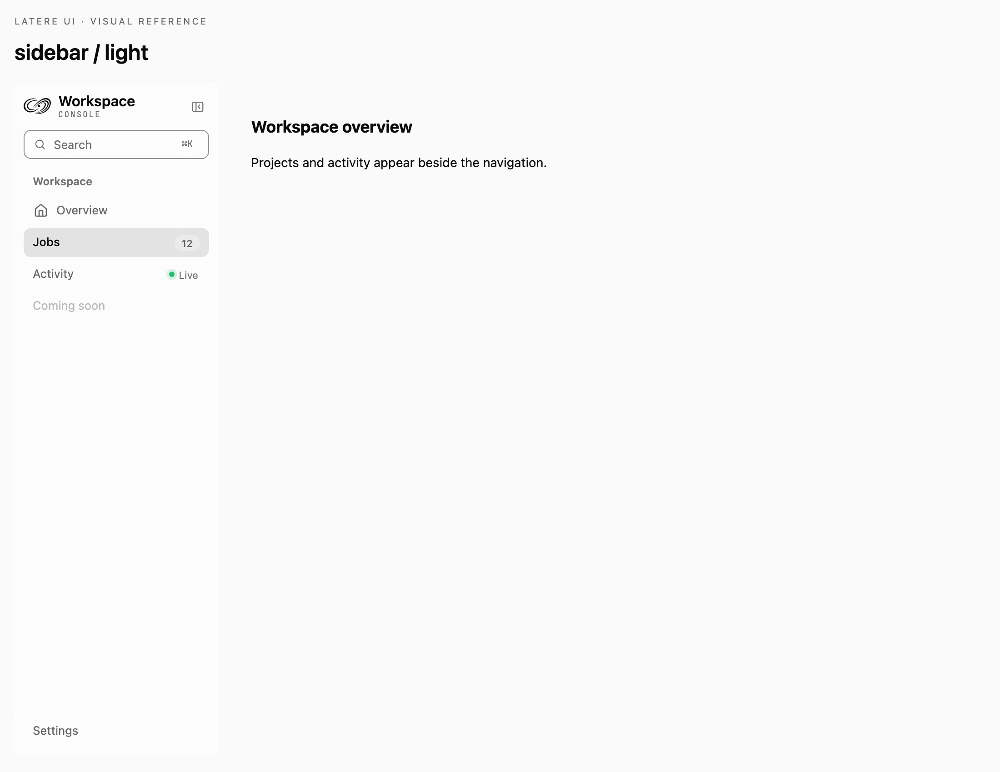

The sidebar supports a collapsed rail and custom brand, row, and footer content. Keep route selection in the host application. Use a modal for a focused decision, a drawer for a side task, and a popover for a local choice.

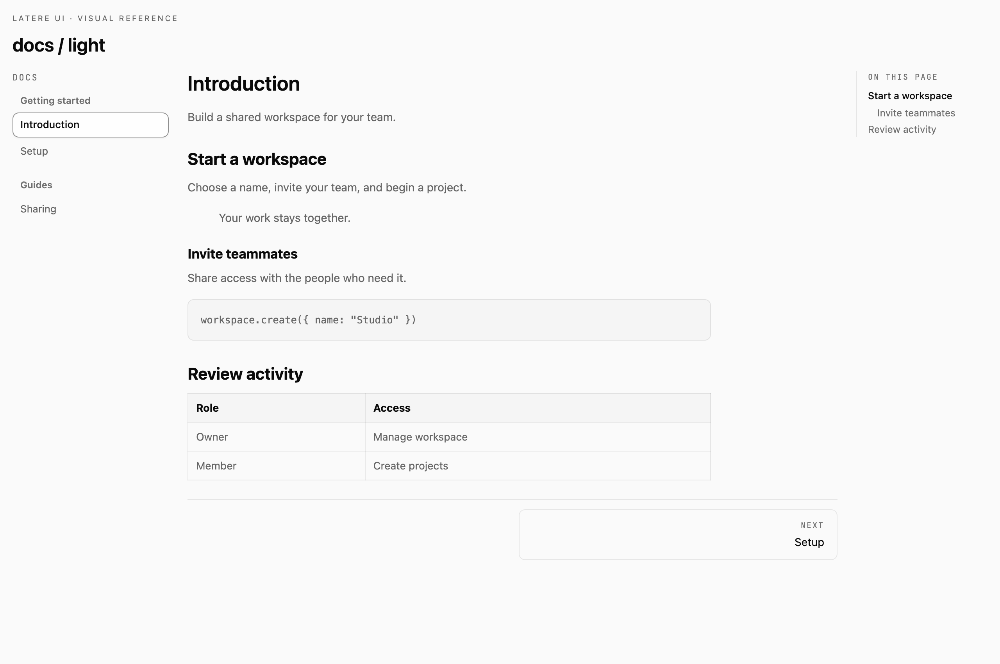

`DocsLayout` gives long-form material a reading order: grouped index, article, then table of contents. The mobile layout puts navigation above the article. Keep the article readable independently of the surrounding glass chrome.

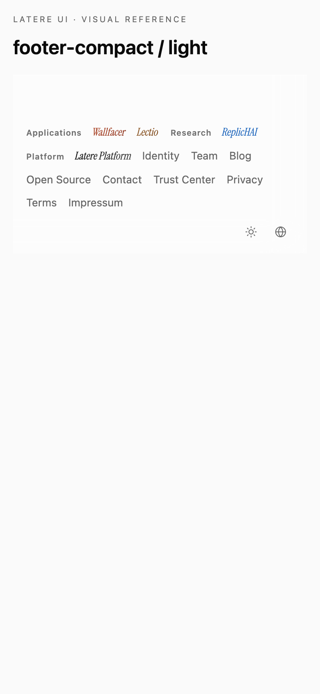

Compact footer links wrap as complete labels, with the theme and language buttons below them. No horizontal scrolling is required to discover the links.

The full footer leaves room around its content. A lead block on the left holds the site's lockup, the social profiles, a short hairline, and the theme and language buttons. Four link columns sit to its right: Applications with Research below it, Platform, Company, and Legal. Each group is a semibold heading in the full text tone over plain links set 32px apart, and the copyright closes the footer. Below 1024px the lead moves above the columns; on a phone the columns go two up and the lead follows them. A host sets its own lockup in place of the Latere AI mark.

Product names in the columns rest in the same face and color as their neighbors, so each column reads as one list. A product takes its gradient under the pointer or keyboard focus. The compact strip keeps its italic wordmarks.

Both footer layouts show navigation without underlines, at rest and under the pointer; the pointer changes the color, and keyboard focus shows an outline. These styles belong to the footer and need no page-wide link reset. Article links outside the footer retain the host's styling.

Account triggers separate the display name from role and workspace metadata with a 4px gap. Preference pills center their labels by cap height and alphabetic baseline, keeping selected and unselected labels aligned across fonts. Browsers without CSS `text-box` support retain ordinary flex centering.

## Offer preferences as native menus

The theme and language controls are quiet round icon buttons, 32px, and 44px on touch screens. The theme button shows the current preference, a sun, a moon, or a monitor for following the system; the language button shows a globe. Each opens a menu on a solid surface with a hairline edge and the menu shadow: 32px rows, a check beside the current choice in its own column, and a corner concentric with the rows. The arrow keys move through the rows, Escape closes the menu and returns to the button, and Tab moves on. `ThemeMenu` and `LocaleMenu` are the same controls for a header.

Theme and language choices belong to the host's preferences. Supply the language options your application supports; English, Chinese, and German footer copy ships in the package. Resolve an automatic theme to a concrete light or dark theme before applying it to the document. The footer, a header's menu and the account preferences each report a choice and show the value they are given: keep one preference in the host and they stay in step.

## Draw the platform in ink

Each product keeps its hue: Wallfacer's copper and ReplicHAI's blue. The platform is the ground they stand on, so its mark is the ink itself, near-black to graphite in the light theme and off-white to silver in the dark theme. The gradients are the `--lu-brand-*` tokens.

## Add optical effects deliberately

The CSS material works without JavaScript. The optional Liquid Glass runtime adds edge refraction where the browser supports it and a cursor-following sheen on opted-in surfaces. React exports `initLiquidGlass`, `refract` and `sheen`; Vue also provides its lifecycle composable. Use sheen on a deliberate feature panel, where pointer movement helps explain the surface.

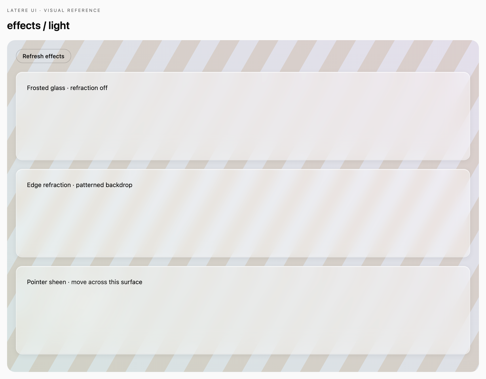

Test effects over a recognizable backdrop so refraction is visible. Check both themes, a resized surface, and preference changes. Reduced motion suppresses sheen; reduced transparency suppresses refraction. The material also has contrast and backdrop-filter fallbacks. Verify actual foreground contrast when you customize the palette or background.

## Keep the figures reviewable

Golden figures are committed PNGs from the browser fixtures, using fixed content, platform UI fonts with bundled brand/code fonts, and named viewport/theme combinations. They render at 2× the CSS layout size, as on a high-density display. The design skeleton is SVG and scales without pixelation. Their filenames identify the appearance, scenario, theme, and viewport. For example, `origo-buttons-dark-desktop.png` shows the button fixture in the Origo appearance in dark mode at the desktop size. Vue and React render each fixture with identical pixels, so one figure shows both adapters.

The [reference index](visual-reference.md) maps components to their figures. Contributors compare, inspect, and update them as described in [Contributing](../CONTRIBUTING.md), and the [review records](reviews/README.md) document each deliberate regeneration, the defects it corrected, and the coverage limits.

Shared styles define the appearance for both adapters. Canonical examples must match every decoded RGBA pixel across Vue and React before either adapter baseline is accepted; no channel differences or antialiased pixels are ignored. Baselines remain separate by framework and rendering platform. A screenshot verifies appearance at one point in a scenario. Interaction tests verify what happens when a reader types, selects, opens, dismisses, or navigates.
