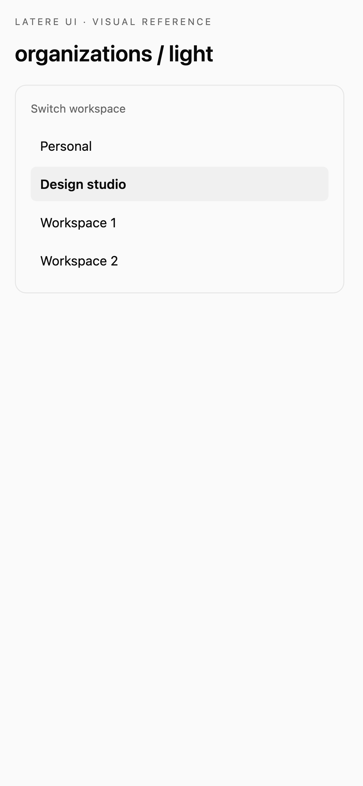

# React console and account components

These APIs are available on unreleased `main`; v1.28.1 predates the complete shell adapters. Import the shell components from `latere-ui/react`. They use the same component styles and models as the Vue adapters. Import the layout and material styles once in your app:

```tsx
import 'latere-ui/tokens';
import 'latere-ui/glass';
import 'latere-ui/console';
import 'latere-ui/docs';
import {
  ConsoleSidebar, ConsolePalette, DocsLayout, AccountPrefs,
  ProductSwitcher, OrgSwitcher, useOrgSwitcher,
} from 'latere-ui/react';
```

The same components support default glass, Replichai, Wallfacer and Origo. To select a preset, import `latere-ui/presets` after these styles and set `data-design` on `<html>` before mounting. Set `data-theme` to `light` or `dark`; this also styles portals. Load the preset fonts through your application: Inter for Replichai/Wallfacer, IBM Plex Sans and Mono for Origo. See [appearance setup](design-system.md#keep-product-styling-explicit).

The visual matrix includes every shell component in both frameworks, both themes and desktop/mobile. Canonical Vue and React examples must have identical decoded RGBA pixels, including antialiasing, before their references can be recorded. Behavior tests separately exercise the controls described below.

## Navigation and product switching

`ConsolePalette` accepts `open`, a `ConsoleNavModel` in `model`, and `onClose` / `onNavigate(item)`. Connect the sidebar's `onSearch` callback to the palette's open state. The palette searches enabled rows with a `to` target, focuses its input, supports arrow selection and Enter, and restores focus when closed. Customize its copy with `placeholder` and `emptyLabel`.

`ProductSwitcher` accepts the current product slug in `current`, an optional `products` list, `labels`, and `size` (`sm` or `md`). The current product is marked without a link. Other tiles navigate to their configured URLs. Its panel adjusts to viewport edges and updates when the page scrolls or resizes. Use `ConsoleSidebar`'s `product` and `productLabels` props to include it in the expanded sidebar head; it hides in the collapsed rail.

## Account preferences

Preferences remain controlled by your application:

```tsx
<AccountPrefs
  theme={theme}
  locale={locale}
  localeOptions={[
    { code: 'en', label: 'EN', name: 'English' },
    { code: 'de', label: 'DE', name: 'Deutsch' },
  ]}
  onSetTheme={setTheme}
  onSetLocale={setLocale}
/>
```

Pass this element to `AccountMenu`'s `prefs` prop. `labels` overrides the language/theme section names and light/dark/auto labels. Your application applies the selected theme and persists preferences.

## Organization selection

`useOrgSwitcher` loads organizations and provides plain React state to the headless list:

```tsx
const organizations = useOrgSwitcher({
  getOrgs: loadOrganizations,
  getCurrentOrgID: () => activeOrgId,
  switchOrg: selectOrganization,
  personalLabel: 'Personal',
  eager: true,
});

<OrgSwitcher
  state={organizations}
  header={currentLabel => <h3>{currentLabel}</h3>}
  renderError={() => <p>Organizations could not be loaded.</p>}
/>
```

The host must re-render when its active organization changes. An empty ID selects the personal context. The hook returns `items`, `currentLabel`, `loading`, `error`, `refresh()`, `select(id)`, and `selectPersonal()`. A failed refresh sets `error`; calling `refresh()` clears the error and retries. Selection errors remain the host's responsibility through the returned promise. Later refreshes supersede earlier requests, and unmounted hooks ignore pending results.

Style `.latere-org-switcher__button` and the `data-active`, `data-owner`, and `data-loading` attributes in your application. `renderItem(item, select)` replaces a row's button; `select()` returns the selection promise. `header` accepts a React node or a function receiving the current label. `renderError(error)` replaces error content.

The visual gallery demonstrates a compact host presentation with a visible current row and keyboard focus. Wrap the chooser in `.organization-demo` and adapt the [example CSS](../tests/visual/organization-demo.css), which uses the active preset's tokens. These example styles are not part of the headless component's default appearance.



## Documentation layout

`DocsLayout` accepts the same grouped document model and navigation props as Vue: `groups`, `activeSlug`, optional `activeGroupId`, `base`, and `routerLink`. An injected router link must forward its DOM attributes and render children. `onNavigate(doc)` receives the selected `FlatDoc`.

Pass rendered, trusted HTML through `articleHtml`, or a React node through `article`. `articleTitle` overrides the active document's title. The `enhance(element)` callback runs after article rendering and before scanning headings. Enhanced markup and assigned heading IDs survive TOC selection updates.

| Vue slot or event | React prop |
|---|---|
| `#sidebar-head` | `sidebarHead` |
| `#group-icon` | `renderGroupIcon(group)` |
| `#article` | `article` |
| `#toc` | `renderToc({ items, activeId })` |
| `navigate` | `onNavigate(doc)` |
| `toc-select` | `onTocSelect(id)` |

`showToc` controls the TOC column; `tocLevels` defaults to `[2, 3]`. Copy overrides are `eyebrow`, `tocLabel`, `prevLabel`, and `nextLabel`. A `DocsLayoutHandle` ref exposes `refresh()` for host-driven article changes and `toc` for explicit outline control. The controller's `getSnapshot()` returns `{ items, activeId }`; `setActive(id)` selects a heading.
