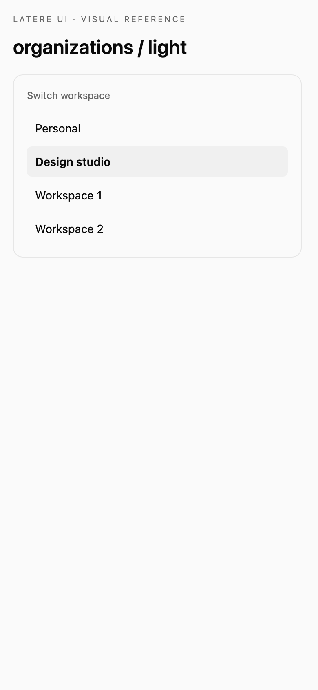

# Console and account components

Import these components from `latere-ui`. Import the layout and material styles once in your app:

```tsx
import 'latere-ui/tokens';
import 'latere-ui/glass';
import 'latere-ui/console';
import 'latere-ui/docs';
import {
  ConsoleSidebar, ConsolePalette, DocsLayout, AccountPrefs,
  OrgSwitcher, useOrgSwitcher,
} from 'latere-ui';
```

The same components support default glass, Replichai, Wallfacer and Origo. To select a preset, import `latere-ui/presets` after these styles and set `data-design` on `<html>` before mounting. Set `data-theme` to `light` or `dark`; this also styles portals. Load the preset fonts through your application: Inter for Replichai/Wallfacer, IBM Plex Sans and Mono for Origo. See [appearance setup](design-system.md#keep-product-styling-explicit).

The visual matrix includes every shell component in both themes at desktop and mobile widths, compared with exact decoded RGBA pixels, antialiasing included. Behavior tests separately exercise the controls described below.

## Navigation

`ConsolePalette` accepts `open`, a `ConsoleNavModel` in `model`, and `onClose` / `onNavigate(item)`. Connect the sidebar's `onSearch` callback to the palette's open state. The palette searches enabled rows with a `to` target, sub-pages included, focuses its input, supports arrow selection and Enter, and restores focus when closed. Customize its copy with `placeholder` and `emptyLabel`.

Pass `items` for entries beyond the rail: actions (`action: true`) and other destinations, each with an optional `group` shown at the row's end, `keywords` that also match, and an `icon`. Pass `search(query)` to append results for a query, such as documentation pages. Every word of the query must appear in a row's label, group or keywords; the chosen row, whichever source it came from, reaches `onNavigate`.

## Account preferences

Preferences remain controlled by your application:

```tsx
<AccountPrefs
  theme={theme}
  locale={locale}
  localeOptions={[
    { code: 'en', label: 'EN', name: 'English' },
    { code: 'de', label: 'DE', name: 'Deutsch' },
  ]}
  onSetTheme={setTheme}
  onSetLocale={setLocale}
/>
```

Pass this element to `AccountMenu`'s `prefs` prop. `labels` overrides the language/theme section names and light/dark/auto labels. Your application applies the selected theme and persists preferences.

## Organization selection

`useOrgSwitcher` loads organizations and provides plain React state to the headless list:

```tsx
const organizations = useOrgSwitcher({
  getOrgs: loadOrganizations,
  getCurrentOrgID: () => activeOrgId,
  switchOrg: selectOrganization,
  personalLabel: 'Personal',
  eager: true,
});

<OrgSwitcher
  state={organizations}
  header={currentLabel => <h3>{currentLabel}</h3>}
  renderError={() => <p>Organizations could not be loaded.</p>}
/>
```

The host must re-render when its active organization changes. An empty ID selects the personal context. The hook returns `items`, `currentLabel`, `loading`, `error`, `refresh()`, `select(id)`, and `selectPersonal()`. A failed refresh sets `error`; calling `refresh()` clears the error and retries. Selection errors remain the host's responsibility through the returned promise. Later refreshes supersede earlier requests, and unmounted hooks ignore pending results.

Style `.latere-org-switcher__button` and the `data-active`, `data-owner`, and `data-loading` attributes in your application. `renderItem(item, select)` replaces a row's button; `select()` returns the selection promise. `header` accepts a React node or a function receiving the current label. `renderError(error)` replaces error content.

The component is headless and ships no styles of its own. This is the presentation the reference figure below uses, with a visible current row and keyboard focus, built on the active appearance's tokens. Wrap the chooser in `.organization-demo`, or adapt the selectors to your own wrapper:

```css
.organization-demo { max-width: 320px; }
.organization-demo .latere-org-switcher__list { list-style: none; margin: 0; padding: 0; display: grid; gap: 4px; }
.organization-demo .latere-org-switcher__button {
  appearance: none;
  box-sizing: border-box;
  width: 100%;
  min-height: 32px;
  padding: 8px 10px;
  border: 0;
  border-radius: var(--radius-sm, 6px);
  background: transparent;
  color: var(--text);
  font: inherit;
  text-align: left;
  cursor: pointer;
}
.organization-demo [data-active="true"] .latere-org-switcher__button {
  background: var(--accent-subtle);
  color: var(--accent);
  font-weight: 600;
}
.organization-demo .latere-org-switcher__button:hover { background: var(--accent-subtle); }
.organization-demo .latere-org-switcher__button:focus-visible { outline: var(--focus-outline); outline-offset: -2px; }
@media (pointer: coarse) { .organization-demo .latere-org-switcher__button { min-height: 44px; } }
```



## Documentation layout

`DocsLayout` accepts the grouped document model and navigation props: `groups`, `activeSlug`, optional `activeGroupId`, `base`, and `routerLink`. An injected router link must forward its DOM attributes and render children. `onNavigate(doc)` receives the selected `FlatDoc`.

Pass rendered, trusted HTML through `articleHtml`, or a React node through `article`. `articleTitle` overrides the active document's title. The `enhance(element)` callback runs after article rendering and before scanning headings. Enhanced markup and assigned heading IDs survive TOC selection updates.

| Prop | Purpose |
|---|---|
| `sidebarHead` | Replaces the eyebrow above the document index |
| `renderGroupIcon(group)` | A group's icon in the index |
| `article` | A React node in place of `articleHtml` |
| `renderToc({ items, activeId })` | Replaces the table of contents |
| `onNavigate(doc)` | Called with the chosen `FlatDoc` |
| `onTocSelect(id)` | Called with the heading chosen in the table of contents |

`showToc` controls the TOC column; `tocLevels` defaults to `[2, 3]`. Copy overrides are `eyebrow`, `tocLabel`, `prevLabel`, and `nextLabel`. A `DocsLayoutHandle` ref exposes `refresh()` for host-driven article changes and `toc` for explicit outline control. The controller's `getSnapshot()` returns `{ items, activeId }`; `setActive(id)` selects a heading.
