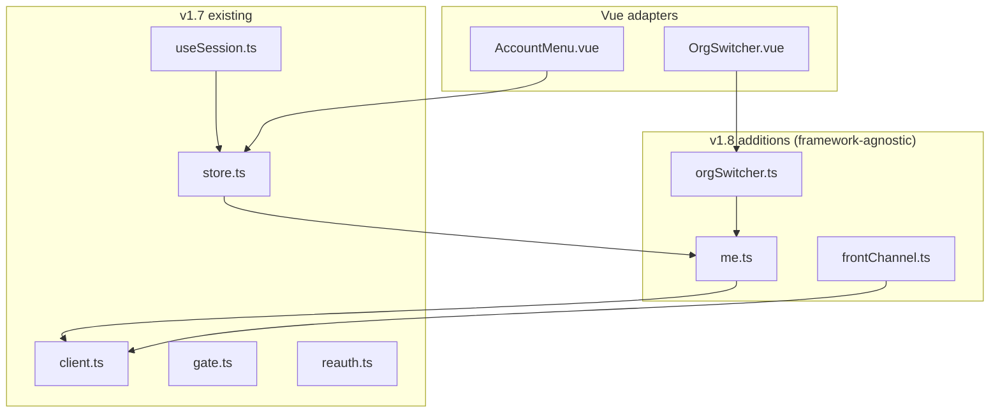

# latere-ui v1.8 — Shared Auth Client

## Overview

`latere-ui` already provides the Vue session client used by six of the eight latere.ai consumer products (`agents`, `latere-ai`, `lectio`, `lux`, `sandbox`, `wallfacer` cloud-mode). This spec adds the framework-agnostic vanilla async core (so Wails / vanilla harnesses can use it), a headless `OrgSwitcher` primitive + `OrgSwitcher.vue` adapter, an SPA `runFrontChannelLogout()` helper, and renames the CSRF cookie to `__Host-latere-csrf`. Existing Vue exports (`createSessionStore`, `useSession`, `useSessionGate`, `AccountMenu`) are preserved and reimplemented atop the new vanilla primitives so the existing consumer call sites do not change.

Independent of backend changes; can land in parallel.

## Current State

`src/index.ts` exports `createApiClient`, `createSessionStore`, `createReauth`, `useSession`, `useSessionGate`, `AccountMenu`, `AccountPrefs`.

`src/session/`:
- `client.ts:14-56` — `createApiClient({ csrfCookie })`: fetch wrapper with CSRF header injection on non-GET/HEAD (`client.ts:36-39`), 401 reauth seam, credentials forwarding.
- `store.ts:18-123` — `createSessionStore` Pinia factory; `me()`/`orgs()`/`switchOrg()` are private closure methods buried inside the store.
- `useSession.ts:67` — bootstrap composable.
- `gate.ts:41` — route gate.
- `reauth.ts:68-72` — silent recheck guard.
- `types.ts:8-77` — `ApiClient`, `Principal`, `OrgEntry`, `SessionStoreOptions`, `UseSessionOptions`.

Existing CSRF cookie names across consumers (renamed by this spec):
- `sandbox/frontend/src/api/client.ts:13` → `__cella_csrf`
- `lectio/frontend/src/api/client.ts:13` → `__lectio_csrf`
- `agents/frontend/src/api/client.ts:13` → `topos_csrf`
- `lux`: no CSRF today; `lux/frontend/src/api/client.ts` does not call `createApiClient`.

Current Vue dependency in `package.json:18-20`: `vue` + `pinia` are **peerDependencies**. No React/Svelte consumer in the monorepo; out of scope per parent spec.

`wallfacer` ships an inline vanilla-JS org switcher at `wallfacer/ui/js/status-bar.js:404-526`. The other four products (agents, lectio, sandbox, lux) have placeholders (`AccountControl.vue`) but no org-switcher UI.

`latere-ai` is the only product with working front-channel logout — server-side template renders iframes per `front_channel_uris`. Its post-mortem in `latere-ai/BUGS.md` documents the learning curve.

## Architecture



The vanilla core (`me.ts`, `frontChannel.ts`, `orgSwitcher.ts`) is usable from any JS framework. The Vue layer (`store.ts`, `useSession.ts`, `OrgSwitcher.vue`) reimplements its logic on top of the vanilla core, preserving public API.

## Components

### Vanilla async core — `src/session/me.ts`

Pure functions taking an `ApiClient` and per-product config:

```ts
export interface MeOptions {
  endpoint?: string                            // default "/api/me"
  mapMe?: (raw: unknown) => Principal | null   // default identity
}

export async function me(client: ApiClient, opts?: MeOptions): Promise<Principal | null>

export interface OrgsOptions {
  endpoint?: string                            // default "/me/orgs"
}

export async function orgs(client: ApiClient, opts?: OrgsOptions): Promise<OrgEntry[]>

export interface SwitchOrgOptions {
  endpoint?: string                            // default "/api/auth/switch-org"
  loginPath?: string                           // fallback if endpoint missing
  defaultReturnTo?: string                     // default "/"
}

export async function switchOrg(client: ApiClient, orgID: string, opts?: SwitchOrgOptions): Promise<void>
export async function switchPersonal(client: ApiClient, opts?: SwitchOrgOptions): Promise<void>

export interface LogoutOptions {
  logoutPath?: string                          // default "/logout"
  redirect?: string | false                    // false → caller chains into runFrontChannelLogout
}

export function logout(client: ApiClient, opts?: LogoutOptions): void

export function login(loginPath: string, returnTo?: string): void
```

Behavior mirrors today's `store.ts:39-123` closures, extracted and decoupled from Pinia. `me` returns `null` on 401/404 (never throws on logged-out). `switchOrg` POSTs JSON body, follows `{redirect_url}` response, falls back to `/login?org_id=…&return_to=…` if endpoint returns 404. `logout` defaults to `window.location.href = logoutPath`.

### Front-channel logout helper — `src/session/frontChannel.ts`

```ts
export interface FrontChannelOptions {
  client: ApiClient
  logoutEndpoint?: string         // default "/api/logout" on the auth host
  iframeTimeoutMs?: number        // default 2000
}

export async function runFrontChannelLogout(opts: FrontChannelOptions): Promise<void>
```

Behavior:
1. GET `/api/logout` (server returns `{app_url, front_channel_uris[], post_logout_redirect}`).
2. For each URI in `front_channel_uris`, append a hidden `<iframe>` with `sandbox="allow-same-origin"` so the iframe's session cookie clears.
3. Race each iframe's `load` event against `iframeTimeoutMs` (default 2000ms — a dead RP must not block the user's logout).
4. `Promise.allSettled` over all iframe races.
5. Remove iframes, navigate to `post_logout_redirect || app_url`.

SSR-safe: no-op without `window`. For `latere-ai` (SSR): the existing server-side iframe rendering at `latere-ai/internal/handler/auth.go:41-48` stays canonical; SPAs use this helper.

### Headless org-switcher — `src/session/orgSwitcher.ts`

```ts
export interface OrgSwitcherDeps {
  getOrgs: () => Promise<OrgEntry[]>
  getCurrentOrgID: () => string | undefined
  switchOrg: (orgID: string) => Promise<void>
}

export interface OrgSwitcherState {
  items: ComputedRef<Array<{ id: string; name: string; slug?: string; active: boolean; owner?: boolean }>>
  currentLabel: ComputedRef<string>
  loading: Ref<boolean>
  error: Ref<unknown>
  select: (orgID: string) => Promise<void>
  selectPersonal: () => Promise<void>
  refresh: () => Promise<void>
}

export function createOrgSwitcher(deps: OrgSwitcherDeps): OrgSwitcherState
```

Vue-reactive state via `ref` + `computed` from `vue` (peer dep). Item ordering: Personal first, orgs in API order, owner badge from `OrgEntry.owner`. The factory renders nothing; consumer products either use the Vue adapter (`OrgSwitcher.vue`) or a vanilla mountpoint (`mountOrgSwitcher(el, opts)` — covers wallfacer's `ui/js/` harness).

### Vue adapter — `src/components/OrgSwitcher.vue`

Unstyled `<ul>` of `<button>`s. Items have `data-active="true"` and `data-owner="true"` attributes for host CSS. Slots: `header`, `item`, `personal-row`. Emits no events (selection goes through the state's `select`).

Visual design is intentionally minimal — each consumer applies its own CSS.

### Vue store refactor — `src/session/store.ts`

Existing `createSessionStore` public API preserved. Internals reimplemented to call the new vanilla core:

```ts
// Old (internal):  const data = await client.get('/api/me'); ...
// New (internal):  const data = await me(client, { endpoint: opts.meEndpoint, mapMe: opts.mapMe })
```

Same for `orgs`, `switchOrg`, `switchPersonal`. Existing consumers (agents, latere-ai, lectio, sandbox) see no public-API change.

### `useSession` refactor — `src/session/useSession.ts`

Existing composable preserved. Internally calls the refactored store + vanilla helpers. Lux's bespoke `useMeStore` continues to work via the existing `mapMe` extension point.

### CSRF cookie naming — `src/session/client.ts`

No code change; `createApiClient` already takes `csrfCookie` as a config option. The doc updates this spec ships specify the unified target name: `__Host-latere-csrf`. Each consumer changes its `createApiClient({ csrfCookie: '__Host-latere-csrf' })` argument after the backend `pkg/oidc.GetSessionByName` shim ships (per `auth/specs/auth-unification/authkit-cookie-and-env-compat.md`).

`__Host-` prefix requires `Secure=true`; dev environments using `InsecureCookies` use the legacy non-`__Host-` name; this dev-mode behavior is documented in the README.

### `src/index.ts` re-exports

Add the new public symbols:

```ts
export { me, orgs, switchOrg, switchPersonal, logout, login } from './session/me'
export { runFrontChannelLogout } from './session/frontChannel'
export { createOrgSwitcher } from './session/orgSwitcher'
export { default as OrgSwitcher } from './components/OrgSwitcher.vue'
export type {
  MeOptions, OrgsOptions, SwitchOrgOptions, LogoutOptions, FrontChannelOptions,
  OrgSwitcherDeps, OrgSwitcherState,
} from './session/me'
```

Existing exports unchanged.

## API Surface

New exports: 10 symbols + 6 types. Total package surface remains small.

## Frontend cookie/env standardization

CSRF cookie target: `__Host-latere-csrf`. Per-product rename PRs land **after** backend dual-read ships (parent spec sequencing step 9). Each consumer's `frontend/src/api/client.ts:13` changes one literal.

Sandbox's session-cookie override (`sandbox/cmd/sandboxd/main.go:687` → `__cella_session`) is a backend concern handled in `sandbox/specs/auth-unification-migration.md`; the frontend just stops sending that cookie name because the backend stops writing it.

## Sequencing

1. Land `me.ts`, `frontChannel.ts`, `orgSwitcher.ts`, `OrgSwitcher.vue` as additive code in `latere-ui v1.8.0`. Public API preserved.
2. Refactor `store.ts` + `useSession.ts` internals onto the new core — no public-API change.
3. Update README with auth-client API section + `OrgSwitcher` example + CSRF cookie naming note.
4. Tag and publish `latere-ui v1.8.0`.
5. Per-product frontend `package.json` bump + `csrfCookie` rename happens in each consumer's migration PR after backend dual-read is in production.
6. Future: deprecate the vanilla `wallfacer/ui/js/status-bar.js` org switcher in favor of `mountOrgSwitcher(el, opts)`.

## Testing Strategy

- **Vitest**:
  - `me.test.ts`: 200 → Principal; 401/404 → null; mapMe applied; endpoint override honored.
  - `orgs.test.ts`: returns OrgEntry[]; endpoint override honored.
  - `switchOrg.test.ts`: POSTs body; follows `{redirect_url}`; falls back to `/login?…` on 404; passes returnTo.
  - `frontChannel.test.ts`: mock `/api/logout` response; iframe creation count matches `front_channel_uris.length`; iframe timeout fires after `iframeTimeoutMs` even if `load` never arrives; final navigation goes to `post_logout_redirect || app_url`; SSR-safe (no `window` → resolves).
  - `orgSwitcher.test.ts`: item ordering Personal-first; active marker matches current; refresh updates items; select calls switchOrg; error surfaces.
- **Playwright** (in whichever product ships `OrgSwitcher` first, likely `sandbox` or `agents`):
  - Render the switcher, click a non-current org, assert redirect URL.
  - Render the switcher, click Personal, assert behavior.

## Risks

- **Existing consumer breakage**: store/useSession refactor must preserve public API exactly. Snapshot tests on the existing exports before refactor; revisit if any consumer fails.
- **Wallfacer version skew**: `wallfacer/frontend/` is on `latere-ui v1.2.3` (large skew per the parent spec's wallfacer migration section). The bump from v1.2.3 to v1.8.0 is its own migration step, handled in the wallfacer migration spec.
- **`__Host-` requires Secure**: dev environments using HTTP need the legacy non-`__Host-` name; the existing `InsecureCookies` toggle must mirror for CSRF cookie. Documented in README.
- **Front-channel iframe timeout** at 2000ms is heuristic. Dead RPs leave their session stale at the cost of the user's logout completing fast. Document this tradeoff in `frontChannel.ts` JSDoc.
- **`OrgSwitcher.vue` styling is unopinionated** — consumers must apply CSS. Provide a minimal example in README so adopters do not see an unstyled list and reach for a different lib.

## References

- Auth backend contract: `auth/INTEGRATION.md` (rewritten per `auth/specs/auth-unification/integration-doc-rewrite.md`)
- Front-channel logout reference: `latere-ai/internal/handler/auth.go:41-48`, `latere-ai/test_frontchannel_logout.sh`
- Wallfacer vanilla switcher reference: `wallfacer/ui/js/status-bar.js:404-526`
- Existing latere-ui: `src/session/{client,store,useSession,gate,reauth}.ts`, `src/components/AccountMenu.vue`
